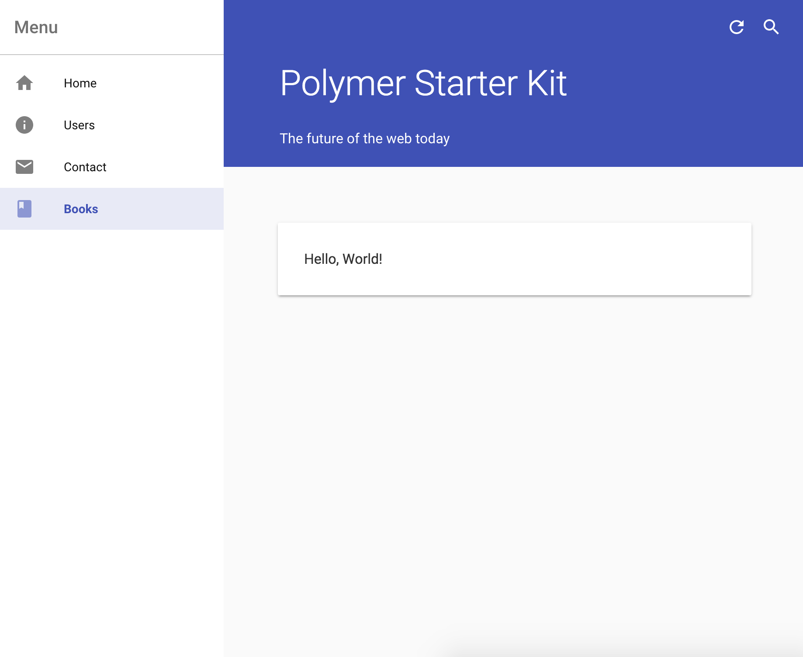

# Create a new page

This Polymer Starter Kit tutorial teaches you how to:

*   Create a new menu item in the navigation menu.
*   Create content for a new page.
*   Route traffic to your new page.

This tutorial assumes you have already completed the
[Set up tutorial](set-up.md).

## Serve the app locally

1.  `cd` to the base directory of your project.

1.  Start the local development server.

        gulp serve

The local development server opens the application in your default
web browser. As you modify your application, the server detects the
modifications, re-builds the application, and reloads your browser
automatically. There is no need to re-load the browser or the application.

## Create a navigation menu item

1.  Open `app/index.html` in a text editor.

1.  Find the navigation menu.

```
...
<!-- Drawer Content -->
<paper-menu attr-for-selected="data-route" selected="[[route]]">
  <a data-route="home" href="{{baseUrl}}">
    <iron-icon icon="home"></iron-icon>
    <span>Home</span>
  </a>
...
```

Each navigation menu item consists of an anchor element (`<a>`) with two
children: `<iron-icon>` and `<span>`.

*   `<iron-icon>` displays a single icon.
*   `<span>` displays the text next to the icon.

1.  Add the following new navigation item to the bottom of the menu.

```
<a data-route="books" href="{{baseUrl}}books">
  <iron-icon icon="book"></iron-icon>
  <span>Books</span>
</a>
```

Your menu should now look like the following:

```
...
<!-- Drawer Content -->
<paper-menu attr-for-selected="data-route" selected="[[route]]">
  <a data-route="home" href="{{baseUrl}}">
    <iron-icon icon="home"></iron-icon>
    <span>Home</span>
  </a>
  ...
  <a data-route="contact" href="{{baseUrl}}contact">
    <iron-icon icon="mail"></iron-icon>
    <span>Contact</span>
  </a>
  <a data-route="books" href="{{baseUrl}}books">
    <iron-icon icon="book"></iron-icon>
    <span>Books</span>
  </a>
</paper-menu>
...
```

If you view the app now, you should see your new item in the navigation
menu, but the link does not point to a valid page yet.

## Add content

In the previous section you added a navigation menu item to enable the
user to navigate to a new page. Now, you add the content for that new page.

1.  Open `app/index.html` in a text editor and find the main content.

```
<div class="content">
  <iron-pages attr-for-selected="data-route" selected="{{route}}">

    <section data-route="home">
      <paper-material elevation="1">
        <my-greeting></my-greeting>

        <p class="subhead">You now have:</p>
        <my-list></my-list>
        ...
      </paper-material>
    </section>

    <section data-route="users">
      <paper-material elevation="1">
        <h2 class="page-title">Users</h2>
        <p>This is the users section</p>
        <a href$="{{baseUrl}}users/Addy">Addy</a><br>
        <a href$="{{baseUrl}}users/Rob">Rob</a><br>
        <a href$="{{baseUrl}}users/Chuck">Chuck</a><br>
        <a href$="{{baseUrl}}users/Sam">Sam</a>
      </paper-material>
    </section>
    ...
```

*   The PSK's design pattern for structuring pages is to make each page a
    `<section>` element. The `<iron-pages>` element controls which page is
    displayed at any given time.
*   The `data-route` attribute is an identifier for the routing system.
    You'll set that up for your new page in the next section.
*   The `<paper-material>` element creates a card which floats on top of the
    main content area. If you want to follow the Material Design
    specification, all main content should be displayed on top of one of these
    cards.
*   The `elevation` attribute determines how high a `<paper-material>` element
    appears to visually float above the main content area. Experiment by
    setting it to values between `0` and `5`.

1.  Add the following content to the bottom of the main section area.

```
<section data-route="books">
  <paper-material elevation="1">
    <p>Hello, World!</p>
  </paper-material>
</section>
```

Your code should now look like the following:

```
...
<!-- Main Content -->
<div class="content">
  <iron-pages attr-for-selected="data-route" selected="{{route}}">
    ...
    <section data-route="contact">
      <paper-material elevation="1">
        <h2 class="page-title">Contact</h2>
        <p>This is the contact section</p>
      </paper-material>
    </section>

    <section data-route="books">
      <paper-material elevation="1">
        <p>Hello, World!</p>
      </paper-material>
    </section>

  </iron-pages>
</div>
...
```

You now have content to link your new navigation item to. In the
next section you'll link your navigation item to your new content.

## Route traffic to the new content

In this last tutorial, you make a minor modification to the routing system
so that when a user clicks on the new "Books" navigation menu item, they
get routed properly to your new page.

1.  Open `app/elements/routing.html` in a text editor and add the following
    code near the bottom of the script, just below the page rule for
    `/contact`.

```
page('/books', function () {
  app.route = 'books';
});
```

Your script should now look like the following:

```
...

page('/', function () {
  app.route = 'home';
});

...

page('/contact', function () {
  app.route = 'contact';
});

page('/books', function () {
  app.route = 'books';
});

...
```

Your new page is now ready! Open your web browser and view it at
[http://localhost:5000/#!/books](http://localhost:5000/#!/books).


