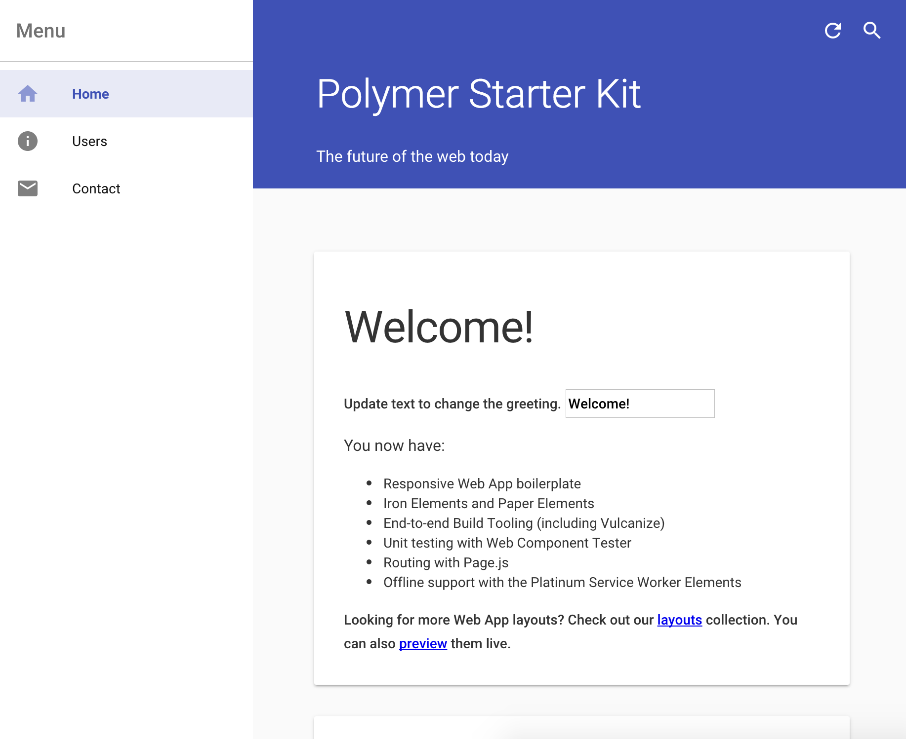

# Set up

The Polymer Starter Kit is a complete starting point for a Polymer 1.0
application. It includes:

*   A [Material Design][md] layout.
*   Routing with Page.js.
*   Unit testing with [web-component-tester](https://github.com/Polymer/web-component-tester).
*   An end-to-end toolchain for build and local development.

Follow the instructions below to install, build, and run the
Polymer Starter Kit (PSK) locally in less than 15 minutes.

## Install the Polymer Starter Kit and dependencies

1.  Install [Node.js](https://nodejs.org/) (`node`) version 0.12 or above.
    Node.js includes Node Package Manager (`npm`) by default. The PSK
    uses `npm` to install and manage tooling.

1.  Verify that you're running `node` version 0.12 or above and `npm`
    version 2.11 or above.

        node -v
        v0.12.5

        npm -v
        2.12.2

1.  Install Gulp and Bower.

        npm install -g gulp bower

    Note: the `-g` flag installs Gulp and Bower globally, so you may need to
    execute the script with `sudo` privileges. The reason they are installed
    globally is because some scripts in the PSK expect
    `gulp` and `bower` to be available from the command line.

1.  Download the [latest PSK release](https://github.com/PolymerElements/polymer-starter-kit/releases/latest).

    There are two versions of the PSK, a light version (e.g.
    `polymer-starter-kit-light-x.x.x.zip`)
    and a full version (e.g. `polymer-starter-kit-x.x.x.zip`). Download
    the full
    version.

1.  Unzip the file to a suitable location. After unzipping the file
    you should have a directory called `polymer-starter-kit-x.x.x`.
    You can rename the directory to something more relevant to your project.

1. `cd` into the base directory of your PSK project.

1.  Install the build and toolchain dependencies.

        npm install

1.  Install the application dependencies.

        bower install

## Directory structure

The diagram below is a brief summary of the directories within the PSK.

    /
    |---app/
    |   |---elements/
    |   |---images/
    |   |---scripts/
    |   |---styles/
    |   |---test/
    |---docs/
    |---dist/

*   `app/` is where you store all of your source code and do all of your
    development.
*   `elements/` is where you keep your custom elements.
*   `images/` is for static images.
*   `scripts/` is the place for JS scripts.
*   `styles/` houses your app's [shared styles][shared styles] and CSS rules.
*   `test/` is where you [define tests for your web
    components](https://github.com/Polymer/web-component-tester).
*   `docs/` contains optional "recipes" (how-to guides) for adding features
    to your application or for using optional tools or editors.
*   `dist/` is the directory to deploy to production. When you run the
    build task, files are prepared for production (HTML imports are
    vulcanzied, scripts are minimized, and so on) and output to this directory.

## Initialize Git repository (optional)

Your PSK installment does not contain any version control system. Follow the
instructions below if you want to manage your source code with Git.

1.  `cd` into the base directory of your PSK project.

1.  Initialize a Git repository.

        git init

1.  Add and commit all of the files.

        git add . && git commit -m "Add Polymer Starter Kit."

## Build and serve

The PSK is ready to be built and ran locally.

1. `cd` into the base directory of your PSK project.

1.  Build the app.

        gulp

1.  Serve the app locally.

        gulp serve

    The local development server automatically detects file modifications
    and re-builds the application. As long as you keep the `gulp serve`
    task running there is no need to re-build or re-serve the app while
    you develop.

    The task above automatically opens up your default web browser and
    fetches the locally-hosted application (at `http://localhost:5000`).

## Next steps

Now that your PSK is up and running, learn how to [add a new page of
content](create-a-page.md), or how to [deploy the app to the
web](deploy.md).

[shared styles]: /1.0/docs/devguide/styling.html#style-modules
[md]: http://www.google.com/design/spec/material-design/introduction.html
